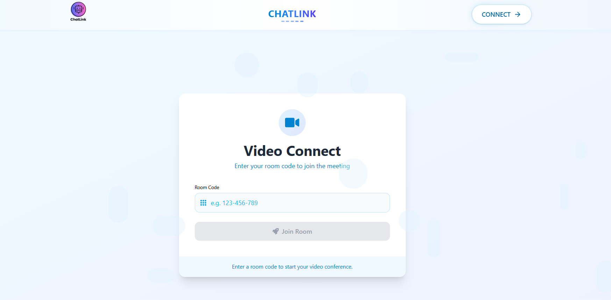
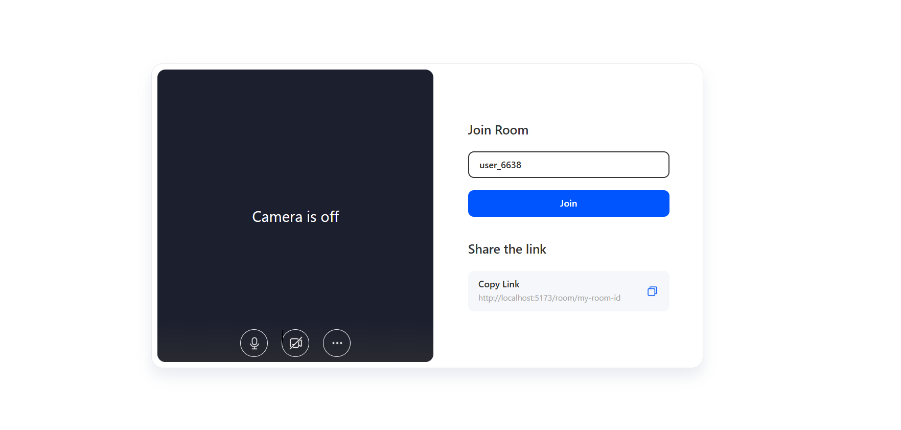
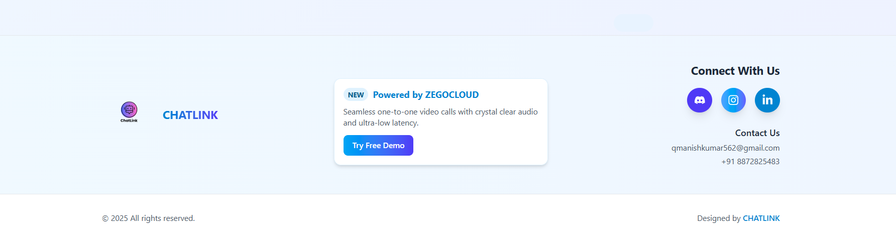

# ChatLink

A modern, secure, and easy-to-use one-to-one video calling web app powered by ZEGOCLOUD.

---

## 🚀 Features

- **Seamless Video Calls:** Crystal clear audio and ultra-low latency video.
- **Room Code System:** Join meetings easily with a unique room code.
- **Modern UI:** Responsive, glassmorphism-inspired design.
- **Social Integration:** Quick links to Discord, Instagram, and LinkedIn.
- **Powered by ZEGOCLOUD:** Reliable and scalable video infrastructure.

---

## 🖼️ Preview

<div align="center">
  
  <br/>
  
  <br/>
  
</div>

---

## 🛠️ Getting Started

### 1. Clone the repository

```bash
git clone https://github.com/kumarmanish562/ChatLink.git
cd ChatLink/chatlink
```

### 2. Install dependencies

```bash
npm install
```

### 3. Set up environment variables

Create a `.env` file in the `chatlink` directory:

```env
VITE_ZEGO_APP_ID=your_zegocloud_app_id
VITE_ZEGO_SERVER_SECRET=your_zegocloud_server_secret
```

**Note:**  
Never commit your `.env` file or secrets to version control.

### 4. Start the development server

```bash
npm run dev
```

Visit [http://localhost:5173](http://localhost:5173) in your browser.

---

## 📁 Project Structure

```
chatlink/
├── public/
├── src/
│   ├── assets/
│   │   ├── dummystyles.js
│   │   ├── logo.png
│   │   ├── read1.png
│   │   ├── read2.png
│   │   └── read3.png
│   ├── components/
│   │   ├── Footer.jsx
│   │   ├── HomePage.jsx
│   │   └── Navbar.jsx
│   ├── pages/
│   │   ├── Home.jsx
│   │   └── Room.jsx
│   ├── App.jsx
│   ├── index.css
│   └── main.jsx
├── .env
├── .gitignore
├── package.json
├── vite.config.js
└── README.md
```

---

## 📝 Usage

1. **Home Page:**  
   Enter a room code and click "Join Room" to start or join a video call.

2. **Video Room:**  
   Experience real-time video and audio powered by ZEGOCLOUD.

3. **Footer:**  
   Connect with us on social media or reach out via email.

---

## 🤝 Contributing

Pull requests are welcome! For major changes, please open an issue first to discuss what you would like to change.

---


## 🙏 Acknowledgements

- [ZEGOCLOUD](https://www.zegocloud.com/) for video infrastructure.
- [React](https://react.dev/)
- [Vite](https://vitejs.dev/)
- [Tailwind CSS](https://tailwindcss.com/) (via custom utility classes)

---


<div align="center">
  <b>Made with ❤️ by Manish Kumar</b>
</div>